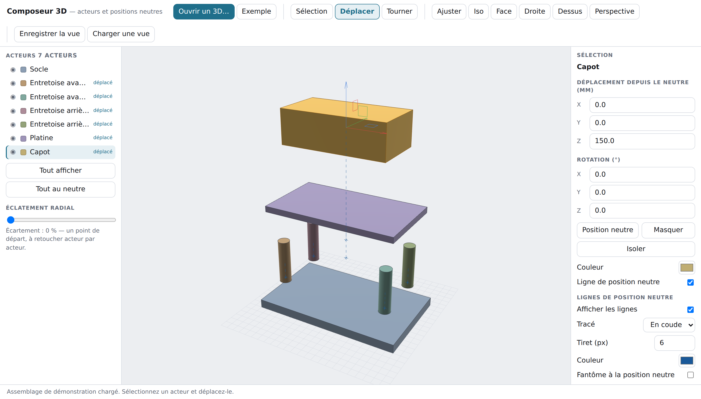

# Composeur 3D — acteurs, positions neutres et vues éclatées

Un outil de mise en scène 3D dans l'esprit de SolidWorks Composer, entièrement
dans le navigateur : on ouvre un fichier CAO, chaque corps devient un **acteur**
que l'on déplace et fait tourner librement, et un trait pointillé le relie à sa
**position neutre** — la position d'origine dans l'assemblage.

Aucune installation, aucune dépendance, aucun envoi de fichier : ouvrez
`index.html` dans un navigateur récent (ou glissez-y votre fichier 3D). Tout le
calcul, y compris la lecture du STEP, se fait sur votre poste.



## Ce que fait cette première version

| | |
|---|---|
| **Import** | STL (binaire et ASCII), OBJ, 3MF, STEP AP203/AP214 |
| **Acteurs** | arborescence, sélection multiple, visibilité, isolement, couleur |
| **Déplacement** | manipulateur 3 axes + 3 plans, saisie numérique au millimètre |
| **Rotation** | anneaux X/Y/Z, saisie en degrés, rotation d'un groupe autour de son centre |
| **Position neutre** | retour immédiat (touche `N`), fantôme translucide, lignes pointillées en coude ou directes |
| **Éclatement** | écartement radial global, à retoucher acteur par acteur |
| **Vue** | perspective ou orthographique, vues normalisées, ajustement, grille au sol |
| **Enregistrement** | les positions et les réglages s'exportent en JSON et se rechargent sur le même modèle |

Les lignes de position neutre suivent l'acteur en permanence : elles sont
recalculées à chaque image, avec des tirets d'une longueur constante à l'écran,
donc lisibles quel que soit le zoom.

## Prise en main

1. **Ouvrir un 3D…** (ou glisser-déposer un fichier dans la vue).
   Le bouton **Exemple** charge un petit assemblage intégré pour essayer sans fichier.
2. Cliquer un acteur, dans la vue ou dans la liste.
3. **Déplacer** (`G`) ou **Tourner** (`R`), puis tirer une poignée du manipulateur.
   `Maj` enfoncé impose un pas fixe (10° en rotation, un sous-multiple de la grille en translation).
4. La ligne pointillée vers la position neutre apparaît dès que l'acteur bouge.
   **Position neutre** (`N`) le remet en place.

Navigation : bouton gauche sur le vide = rotation de la vue, clic milieu ou
`Alt` = translation, molette = zoom, `F` = ajuster, `Ctrl`+`Z` = annuler.

## Formats et limites

**STL / OBJ** — un fichier qui ne contient qu'un seul bloc est automatiquement
redécoupé en corps distincts par composantes connexes. Deux pièces collées le
long d'une arête commune restent toutefois confondues : c'est une limite du
format, pas de l'outil.

**3MF** — l'archive est lue directement (`DecompressionStream`), les objets, les
composants et les transformations de placement sont respectés, l'unité déclarée
est convertie en millimètres.

**STEP** — le fichier décrit des surfaces exactes, qui sont facettisées ici :

- surfaces traitées : plan, cylindre, cône, sphère, tore ;
- arêtes traitées : segment, cercle, ellipse, B-spline (évaluation de De Boor) ;
- les faces bornées uniquement par des coutures (cylindre ou sphère complets)
  sont reconstruites en entier ;
- les transformations d'assemblage et les noms de pièces (`PRODUCT`) sont repris ;
- **les surfaces gauches (B-splines) sont ignorées** et signalées. Pour une pièce
  de style « carrosserie », passez par un export STL ou 3MF.

L'écart de corde admis est de 0,15 mm. Sur les échantillons de test, le volume
facettisé d'un cylindre et d'une sphère reste à moins de 2 % de la valeur exacte.

## Ce qui n'y est pas encore

Vues enregistrées multiples, animation par clés temporelles, repères et bulles
d'annotation, nomenclature, export d'images haute définition, arborescence
hiérarchique de l'assemblage (les acteurs sont pour l'instant une liste à plat).

## Organisation du code

| Fichier | Rôle |
|---|---|
| `js/m3d.js` | vecteurs, quaternions, matrices, intersections rayon/plan/triangle |
| `js/import.js` | STL, OBJ, 3MF (lecture ZIP incluse), séparation en corps |
| `js/step.js` | analyse STEP et facettisation des surfaces |
| `js/mesh.js` | normales lissées à arêtes vives, arêtes techniques, boîte englobante |
| `js/view.js` | rendu WebGL et caméra orbitale |
| `js/scene.js` | acteurs, positions neutres, lignes, sélection au lancer de rayon |
| `js/gizmo.js` | manipulateur de translation et de rotation |
| `js/app.js` | interface, import, arborescence, raccourcis |

## Tests

```sh
node composer/tests/make-samples.mjs   # échantillons STEP à surfaces courbes et 3MF
node composer/tests/run.mjs            # géométrie et import (aucune dépendance)
node composer/tests/run-ui.mjs         # interface, dans un navigateur (Playwright)
```

`run.mjs` compare les aires et volumes facettisés aux valeurs analytiques ;
`run-ui.mjs` pilote un vrai navigateur : import, tirage des poignées du
manipulateur, lignes de position neutre, annulation, relecture d'une vue.
Il s'annonce ignoré si Playwright n'est pas installé.
